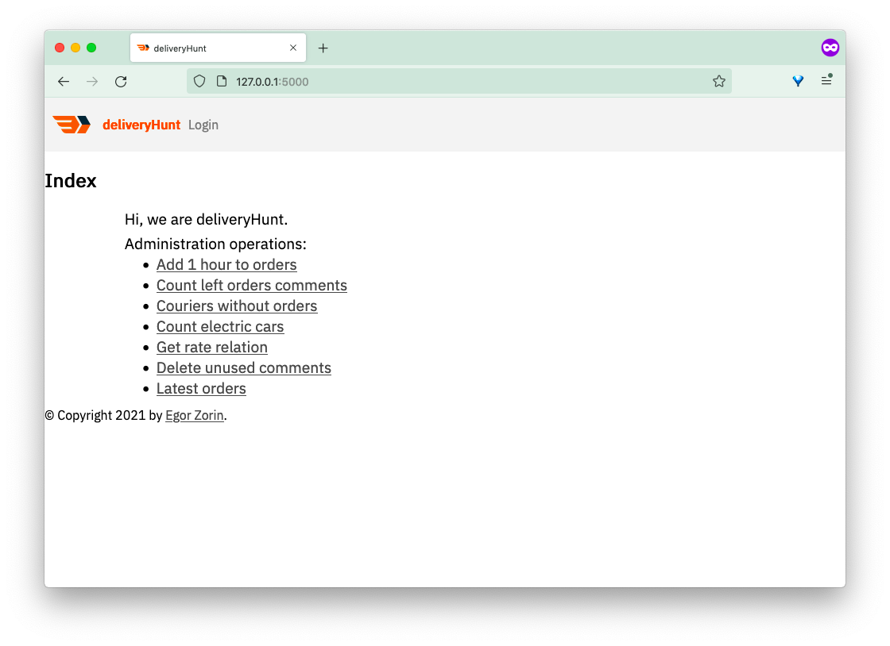
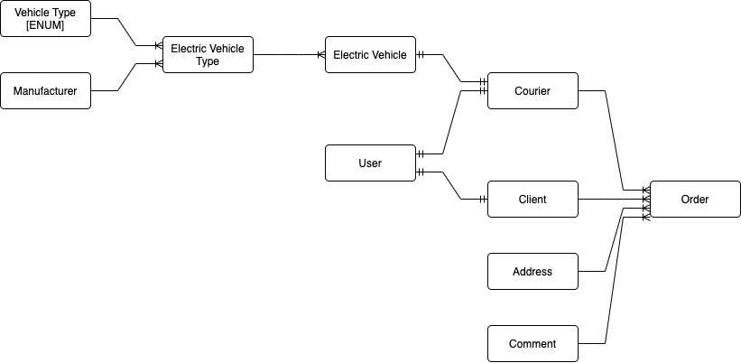
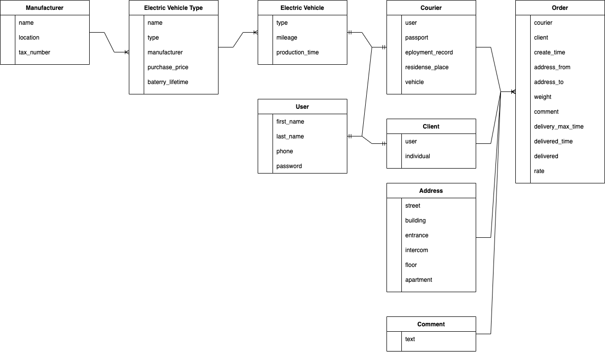
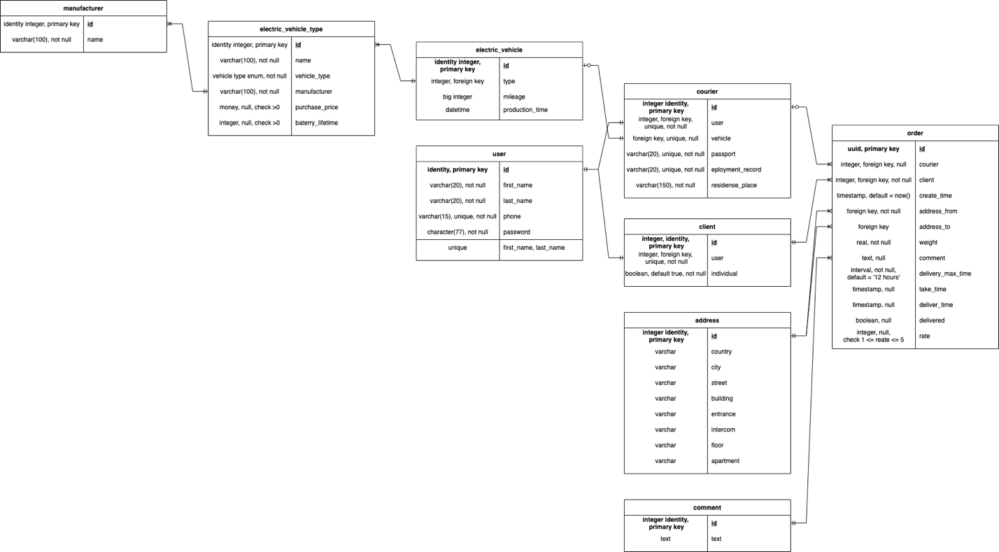
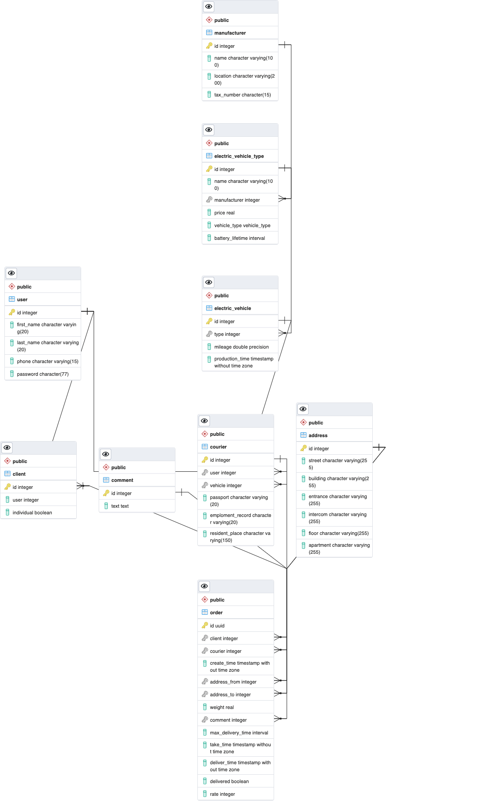
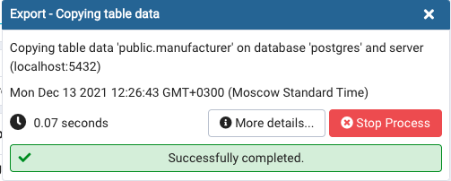
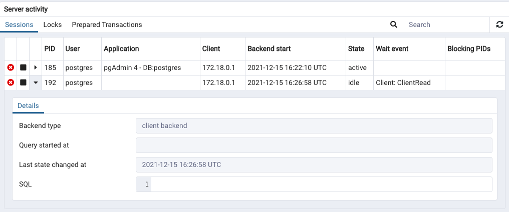
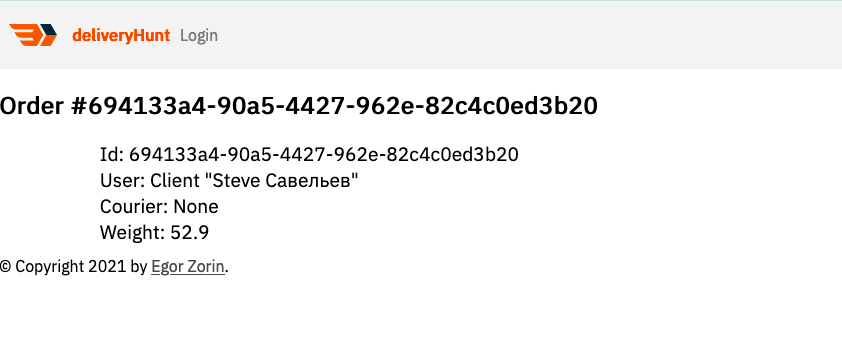

# deliveryHunt

deliveryHunt - express delivery service.



## Security

- Password (argon2 adaptive hashing)
- SQL injection (psycopg3 escape placeholders)
- XSS (Jinja template escape variables)
- Session authentication (Flask secret key encrypted by secret_key)
- CSRF (Python secrets CSRF token + encrypted session)

## Description

КУРСОВОЙ ПРОЕКТ

**на тему:**

**«[Проектирование и реализация]{.underline}**

**[информационной системы курьерской службы»]{.underline}**

Студент Зорин Егор Альбертович

> (ФИО) (подпись)

Санкт - Петербург

2021

**МИНИСТЕРСТВО НАУКИ И ВЫСШЕГО ОБРАЗОВАНИЯ**

**РОССИЙСКОЙФЕДЕРАЦИИ**

федеральное государственное автономное образовательное учреждение

высшего образования

«Санкт-Петербургский политехнический университет Петра Великого»

(ФГАОУ ВО «СПБПУ»)

**Институт среднего профессионального образования**

Отделение информационных технологий

**Задание на курсовое проектирование**

**по МДК 11.01 «Технологии разработки и защиты баз данных»**

Специальность: 09.02.07 Информационные системы и программирование

**студенту** Зорину Е.А**.** группа\_\_[32919/1]{.underline}\_\_\_\_

(фамилия, инициалы)

**Тема:** **Проектирование и реализацияинформационной системы курьерской
службы**

**Перечень подлежащих разработке вопросов:**

1. Аналитический обзор программных средств, технологий, аналогов ПП для
   создания базы данных и интерфейсов пользователей.

2. Проектирование реляционной базы данных (инфологическая и
   даталогическая модели с указанием связей (с пояснениями) между
   таблицами).

3. Разработка механизмов управления данными в БД (добавление, удаление и обновление

данных).

4. Организация выборки информации из разработанной базы данных
   (сформулировать не менее 5 запросов всех типов, реализуемых
   средствами выбранной СУБД).

5. Проработка технологии доступа к базе данных (определение круга
   пользователей базы данных и оценка возможности разграничения
   полномочий пользователей).

6. Разработка ПО для решения поставленной задачи.

7. Разработка алгоритмов программных модулей.

8. Тестирование работы приложения.

9. Оформление документации (руководство системного программиста).

10. Оформление пояснительной записки.

Cодержание

[Введение [2](#введение)](#введение)

[1. Анализ предметной области и сравнение средст разработки
[4](#анализ-предметной-области-и-сравнение-средст-разработки)](#анализ-предметной-области-и-сравнение-средст-разработки)

[1.1. Описание и анализ предметной области
[4](#описание-и-анализ-предметной-области)](#описание-и-анализ-предметной-области)

[1.2. Проектирование физической модели базы данных
[9](#проектирование-физической-модели-базы-данных)](#проектирование-физической-модели-базы-данных)

[1.3. Сравнение систем управления базой данных
[11](#сравнение-систем-управления-базой-данных)](#сравнение-систем-управления-базой-данных)

[1.4. Выбор языка программирования для серверной части
[14](#выбор-языка-программирования-для-серверной-части)](#выбор-языка-программирования-для-серверной-части)

[1.5. Сравнение серверных веб фреймворков Python
[17](#сравнение-серверных-веб-фреймворков-python)](#сравнение-серверных-веб-фреймворков-python)

[1.6. Выбор драйвера для базы данных
[19](#выбор-драйвера-для-базы-данных)](#выбор-драйвера-для-базы-данных)

[2. Разработка запросов к базе данных
[20](#разработка-запросов-к-базе-данных)](#разработка-запросов-к-базе-данных)

[2.2. Запуск и конфигурация СУБД
[20](#запуск-и-конфигурация-субд)](#запуск-и-конфигурация-субд)

[2.3. Создание структуры базы данных
[23](#создание-структуры-базы-данных)](#создание-структуры-базы-данных)

[2.4. Заполнение тестовыми значениями
[26](#заполнение-тестовыми-значениями)](#заполнение-тестовыми-значениями)

[2.5. Разработка запросов
[30](#разработка-запросов)](#разработка-запросов)

[3. Разработка клиентсокго приложения
[37](#разработка-клиентсокго-приложения)](#разработка-клиентсокго-приложения)

[3.2. Архитектура веб приложения
[38](#архитектура-веб-приложения)](#архитектура-веб-приложения)

[3.3. Подключение к базе данных серверной части
[38](#подключение-к-базе-данных-серверной-части)](#подключение-к-базе-данных-серверной-части)

[3.4. Разработка ORM для базы данных
[39](#разработка-orm-для-базы-данных)](#разработка-orm-для-базы-данных)

[3.5. Разработка пользовательской аутентификации
[40](#разработка-пользовательской-аутентификации)](#разработка-пользовательской-аутентификации)

[3.6. Защита веб приложения
[41](#защита-веб-приложения)](#защита-веб-приложения)

[3.7. Разработка пользовательского интерфейса
[42](#разработка-пользовательского-интерфейса)](#разработка-пользовательского-интерфейса)

[3.8. Разработка интерфейса администратора
[43](#разработка-интерфейса-администратора)](#разработка-интерфейса-администратора)

[Заключение [44](#заключение)](#заключение)

# Введение {#введение .list-paragraph .Раздел}

1. С развитием технологий и движением времени в общем, развивается и
   транспорт, то есть способ более быстрого перемещения. Параллельно с
   этим развивается и сфера аккумуляторов. Новые аккумуляторные батареи
   способны накапливать большее количество энергии и лучше сохранять
   его со временем.

   В логистике участвует множество звеньев, различающихся по: уровню
   обязанностей, количеству/весу перемещаемого груза, времени перевозки
   и другим параметрам. Все это вносит разнообразие в данную предметную
   область, а следовательно и в информационную систему.

   Также ситуация с кароновирусом значительно повлияла на сферу
   логистики. Все чаще и проще можно оформить доставку продуктов, еды
   или товаров из маркетплейса. Все это благодаря высокоразвитой
   инфраструктуры логистики бизнес компаний. Уменьшение количества
   контактирования между людьми приводит к еще большей популярности
   доставки.

   Курьерская связывает между собой: отправителя и получателя заказа,
   посредством: курьеров, сотрудников и выстроенную информационную
   систему. Из этого выходит, что от качества выстроенной
   информационной системы/инфраструктуры зависит успех и качества
   работы самого бизнеса в сфере логистики.

   О разработке такой информационной системе и процессе доставки в
   общей пойдет речь в данной курсовой работе. Целью ее будет
   постараться воссоздать аналогичную информационную систему с
   возможным практическим применением.

   Цель -- разработать информационную систему (базу данных, серверное и
   клиентское приложения) для автоматизации работы курьерской службы
   (управления ресурсами курьерами, а также удобного принятия заказов
   от клиентов).

   Задачи:

- проанализировать и описать предметную область;

- спроектировать работу информационной системы;

- разработать модель базы данных и клиентское приложение.

  1. В данной курсовой работе будет в подробное описание предметной
     области, сравнение технологический и проектировочных
     возможностей и обоснование выбора, скриншоты на этапах
     выполнения, тестирования и в конце, в дополнение будет приложен
     исходный код для воссоздания базы данных и клиентского
     приложения.

1. # Анализ предметной области и сравнение средст разработки {#анализ-предметной-области-и-сравнение-средст-разработки .Раздел}

   

   Рис Логотип компании "deliveryHunt"

## Описание и анализ предметной области {#описание-и-анализ-предметной-области .Подраздел}

1. Экспресс-перевозка -- это деятельность, связанная с предоставлением
   услуг и работами, обеспечивающими вывоз, транспортировку и доставку
   по схеме «от двери до двери» документов и грузов в строго
   ограниченные по времени сроки. Освобождая грузовладельца от всех
   забот по организации перевозки, выбору вида транспорта и схемы
   доставки груза, экспресс-курьер несет перед ним ответственность за
   выполнение перевозки в целом и отдельно за груз с момента его
   принятия в свое распоряжение и до момента выдачи получателю.

   Служба доставки \"deliveryHunt\" специализируется на экспресс
   доставке и занимается доставкой посылок для клиентов использую
   электротранспорт с курьерами по найму. Служба занимается доставкой
   посылок как физический, так и юридических лиц.

   Компания занимается доставкой как грузов, так и документов.
   Большинство посылок - небольшие, со сроком доставки менее 24 часов.

   Курьерская служба осуществляет доставку только в черте г.
   Санкт-Петербург, это позволяет ей превосходить своих конкурентов по
   времени, качестве и цене доставки.

   Все начинается с регистрации:

   Каждый пользователь информационной системы должен быть
   аутентифицирован, для этого необходимо пройти регистрацию. Для
   регистрации всем пользователям необходимо указать имя, фамилию и
   номер телефона. Для курьеров есть дополнительные требования. После
   регистрации клиент имеет возможность оформить доставку посылки

   Местоположения может включать в себя: страну, город, уличу, квартал,
   корпус, парадную, домофон, этаж и номер квартиры. Также к
   дополнительно к заказу может быть оставлено более
   подробная/специфическая информация от клиента. Все адреса будут
   сохранятся и в дальнейшем предоставляться, как вариант для повторной
   доставки в то же место.

   Каждому заказу присваивается универсальный уникальных индефикаторов
   по которому любой сотрудник службы или сам клиент может получить
   информацию о статусе заказа (отслеживать).

   Клиент может оставить предоставить дополнительную информацию о
   заказе в виде комментария. Часто клиенту может понадобиться
   предоставлять одну и ту же информацию о разных заказах, такое как
   «оставить и двери», «не звонить в дверь», «предупредить за 15
   минут».

   Аутентифицированные курьеры видят доступные заказы и могут взять
   его. Когда заказ переходит к курьеру, отсчитывается время доставки.
   Курьер должен доставить заказ в срок в указанное время и место.
   Курьер может брать сразу несколько заказ и ответственен за их
   доставку. Если курьер не успевает доставить заказ ему выписывают
   штраф. Чем тяжелее и дальше заказ, тем больше награда для курьера.
   Курьер может подтверждать взятие и доставку заказа, а также
   связываться на прямую с клиентом для уточнения заказа. Все действия
   курьера и история заказов записываются сохраняются в базе данных.

   В качестве средств передвижения используется электротранспорт:
   электросамокаты, электровелосипеды, электромопеды и
   электроавтомобили. В арсенале службы имеется различные виды
   электротранспорта, отличающиеся по скорости и другим
   характеристикам. Служба хранит информацию о каждом транспорте, его
   типе, времени производства, а также время от времени изменяет и
   обновляет пробег электротранспорта. Каждому курьеру компания
   присваивает собственный электротранспорт (только один), на котором
   он может работать. Курьер должен поддерживать транспорт в хорошем
   состоянии, а также заботиться о подзарядке.

   Сотрудники службы занимаются оптовой закупкой электротранспорта от
   различных производителей. Цена и количество закупке сохраняются в
   базу данных для дальнейшего составления отчетов.

   Также служба занимается ремонтом и поддержанием свободного
   транспорта, сотрудничает с крупными сервисными центрами в
   Санкт-Петербурге.

   Пользовательский телефон должен быть уникален, так как компания
   обеспечивает идентификацию клиентов по номеру телефона, телефон
   должен быть сохранен в таксовом формате, но предварительно
   валидирован. Также должно быть уникально пользовательское имя в
   комбинации с фамилией, служба не поддерживает хранения однофамильцем
   с одинаковыми именами (это так же позволяет уменьшить количество
   повторных регистраций, оповещая клиента, что пользователь с таким
   именем уже существует).

   Авторизация доступа к таблицам и строкам базы данных:

- курьер не может брать взятые заказы (только свободные);

- курьер не может изменять чужие заказы.

  1. Исходя из описание предметной области можно выделить следующий
     функционал приложения:

- клиент

- курьер

- электротранспорт (сотрудники)

  1. Сущности полученные при анализе предметной области:

- пользователь;

- клиент;

- курьер;

- заказ;

- адрес;

- комментарий;

- транспорт;

- виды транспорта;

- производитель.

  1. Каждой сущностей будет соответствовать таблица в базе данных.
     Объект или экземпляр сущности будет представлен в виде строки
     (записи) в таблице базы данных.

     Данные сущности связаны между собой связями:

- один к одному

- многие к одному

  Связи между сущностями:

- объект курьера и клиента могут соответствовать только одному
  зарегистрированному аккаунту (1 к 1);

- курьер и клиент могут иметь множество заказов (1 к М);

- адрес и комментарий могут использоваться во многих заказах (1 к М);

- один электротранспорт может соответствовать только одному курьеру (1
  к 1);

- одни тип транспорта может соответствовать нескольким физическим
  транспортам (1 ко многим);

- один производитель может соответствовать нескольким типам
  электротранспорта (1 к М).

  1. На основании полученных данных можно создать концептуальную
     модель предметной области. Концептуальная или инфологическая
     модель включает в себя только сущности и отношения между ними
     (без учета атрибутов и типов данных). Оно позволяет составить
     полную картину предметной области, понять бизнес задачи и
     сформировать направления для разработки.

     {width="5.966851487314086in"
     height="2.9218755468066493in"}\
     Рис Концептуальная модель предметной области

     После выделения сущностей в области логистики можно переходить к
     формирования атрибутивной модели. Каждая сущность обладает
     набором характеристик (атрибутов), по которым ее можно
     охарактеризовать, а значит сохранить передать информацию о ней.
     Для следующих сущностей перечислены канонические атрибуты
     (атрибуты не полученные из других атрибутов):

- пользователь: идентификатор, имя, фамилия, номер телефона и пароль
  (в хешированном виде);

- клиент: идентификатор клиента, пользовательский аккаунт и атрибут
  определяющий частное или юридическое лицо;

- заказ: идентификатор заказа, клиент, время заказа, адрес отправителя
  и получателя, комментарий к заказу, вес заказа, срок доставки
  (максимальное время доставки), назначенный курьер, время взятия и
  доставки, статут доставки и оценка доставки;

- адрес: улица, номер дома, номер парадной, домофон, этаж и номер
  квартиры;

- комментарий: идентификатор и текст комментария.

- курьер: идентификатор, зарегистрированный аккаунт, паспортные
  данные, место жительства (в свободной форме) и полученный
  электротранспорт;

- электротранспорт: идентификатор транспорта, тип транспорта из
  полученных, измеренный пробег и дата изготовления;

- тип электротранспорта: идентификатор типа, название транспорта, тип
  транспортного средства, производитель, закупочная стоимость 1 шт.,
  длительность заряда батареи;

- производитель: идентификатор, полное название производителя,
  местоположение производитель (свободный текст), ИНН.

  {width="6.482638888888889in"
  height="3.7800951443569555in"}

  Рис Атрибутивная модель сущностей ПО

## Проектирование физической модели базы данных {#проектирование-физической-модели-базы-данных .Подраздел}

1. После создания атрибутивной модели можно приступить к проектированию
   физической модели (модели базы данных). Физическая модель -- это
   модель данных, учитывающая особенности конкретной СУБД (в нашем
   случае PostgreSQL). Она включает себя всю информацию, которая
   предоставляет атрибутивная модель, но также указывает на конкретные
   типы дынных для каждого атрибута (и идентификатора), ключевые
   атрибуты и выбранные ограничения для поддержания целостности.
   Физическая модель больше всех представляет будущую реализацию
   (предметную область в виде базы данных).

   Для хранения данных будут использоваться следующие встроенные типы
   данных полей таблицы:

- переменная строка c максимальным размером (character varying);

- фиксированная строка размера (character);

- текст без ограничения количества символов (text);

- целочисленное значение (integer);

- дата и время без временной зоны (timestamp);

- универсальный уникальный идентификатор (случайно генерируется)
  (uuid);

- интервал/количество времени (interval).

  1. Для того, чтобы поддерживать данные в базе данных в
     нормализованном состоянии будет использован ряд ограничений:

- пользовательские ограничения значения атрибута (check);

- ограничение на пустое значение атрибута (null);

- ограничение на уникальное значение атрибута (unique);

- ограничение первичного ключа (уникальный и не пустой
  атрибут)(primary key);

- ограничение на уникальность нескольких атрибутов вместе (unique);

- ограничения внешнего ключа (значение атрибута должно находиться в
  наборе атрибутов другой сущности) (foreign key);

- действия при удалении или обновлении сущности, от которой зависит
  текущая сущность (on delete, on update).

  1. Также дополнительно будут использовательны более продвинутые
     возможности СУБД PostgreSQL такие как:

- самоидентификатор для первичный ключей (identity);

- пользовательский перечисляемый тип (enum).

  1. Для сущности пользователь будут использованы следующие
     ограничения:

- идентификатор -- первичный ключ;

- имя и фамилия -- уникальная пара значений;

- телефон -- уникальное значение.

- все атрибуты являются обязательными

  1. Для реализации связи 1 ко 1 будет использована комбинация
     ограничений внешнего ключа и уникального значения. Которое
     запрещает ссылаться на одно и то же значение из другой таблицы
     больше одного раза.

     Тип транспорта является фиксированной уникальной коллекцией
     постоянных значений, для этой цели будет создан пользовательский
     перечисляемый тип (Виды транспорта) в котором будут содержаться
     следующее множество значений:

- самокат

- велосипед

- мопед

- автомобиль

  1. Конечный вид модели представлен на рисунке 4.

     {width="6.496527777777778in"
     height="3.5881944444444445in"}

     Рис Физическая модель отражающая курьерскую службу

## Сравнение систем управления базой данных {#сравнение-систем-управления-базой-данных .Подраздел}

2. На данных момент на рынке реляционных систем управления для баз
   данных можно выделить следующие наиболее популярные продукты:

- MySQL

- PostgreSQL

- SQLite

- Microsoft SQL Server

  1. Для проведения сравнительной характеристики будут отобраны
     только СУБД серверного класса (MySQL, PostgreSQL, Microsoft SQL
     Server).

  ***

  **Критерий для **MySQL\*\* **PostgreSQL** **Microsoft SQL
  сравнения** Server\*\*

  ***

  Модель описания Реляционная Реляционная Реляционная
  данных

  Подсистема хранения InnoDB, MyISAC Встроенная Встроенная

  Распространяется Нет Нет Нет
  только как облачный  
  сервис

  Работа в оперативной Да Нет Нет
  памяти

  Лицензия Бесплатная и Бесплатная и Платная/бесплатная и

                     свободная (GPL)   свободная (MIT)    закрытая

  Организация "Oracle "PostgreSQL Global "Microsoft
  (разработчик) Corporation" Development Group" Corporation"

  Инструмент для MySQL Workbench pgAdmin Microsoft SQL Server
  графического Management Studio
  администрирования

  Поддерживаемые Linux, macOS, Linux, macOS, Linux, Windows
  операционные система Windows, Docker Windows, Docker Server, Windows,

                                                          Docker

  Соответствие Неполное Полностью Неполное
  стандарту SQL

  Популярность 50% 40% 26%
  (используемое  
  количество  
  разработчиков)

  Полно-документный Да (ограниченный) Да Да
  поиск

  Наследование таблиц Нет Да Нет

  Транзакции/курсор Да Да Да

  Индексирование Да Да Да

  Триггеры Да Да Да

  Представления Да Да Да

  Процедурный язык SQL:2003 PL/pgSQL, T-SQL
  программирования PL/Python, SQL, C,

                                       JavaScript, Perl

  Клиентские языки C/C++, Python, C/C++, Python, C#, \...
  программирования \... \...

  Типы данных SQL стандарт SQL стандарт + Стандартные +

                                       array, hstore,     пользовательские
                                       пользовательские

  ***

2. Основными минусами MySQL является:

- старость является достаточно старой СУБД со времен LAMP стека для
  веб разработки;

- поддерживается корпорацией «Oracle» в следствии чего большой уровень
  дополнительного коммерческого (платного) функционала.

  1. Основные минусы СУБД PostgreSQL:

```{=html}
<!-- -->
```

- одновременно с большим количеством продвинутого функционала
  увеличивается сложность работы с СУБД и необходимые навыки.

  1. Основные минусы Microsoft SQL Server:

- является платным продуктом. Не подходит для небольших и начинающих
  компаниями с ограниченными финансами;

- является проприетарным продуктом (продуктом с закрытым исходным
  кодом). Нет возможности модифицировать продукт под свои нужны, нет
  возможности исправлять недочеты разработчиков, нет возможности
  контролировать программу (телеметрию и другой скрытых функционал);

- заточена на операционную систему Windows и серверную ОС Windows
  Server. Не будет работать на macOS и не подойдет для развертывания
  на Linux серверах.

  1. Каждая из СУБД имеет свои плюсы и минусы, но мой выбор больше
     всех привлекла PostgreSQL. В настоящее время она является
     наиболее быстро развивающейся СУБД и активно поддерживается
     сообществом разработчиков. Также часть из продвинутого и
     отличительного функционала PostgreSQL будет задействован в
     данной курсовой работе.

## Выбор языка программирования для серверной части {#выбор-языка-программирования-для-серверной-части .Подраздел}

2. Серверная часть веб приложения будет отвечать за:

- взаимодействие с базой данных;

- аутентификацией и авторизацией доступа к данным;

- обработкой и валидацией данных.

  1. Для сравнения будут выбраны три наиболее современных языка
     программирования для бекенд веб разработки:

- Node.js;

- Python;

- Go.

+-----------------+-----------------+-----------------+---------------+
| 1. **Критерий | 2. **Node.js** | 3. **Python** | 4. **Go** |
| сравнения** | | | |
+=================+=================+=================+===============+
| 5. Время | 6. 2009 г. | 7. 2008 г. | 8. 2009 г. |
| | | (v3) | |
| возникновения | | | |
+-----------------+-----------------+-----------------+---------------+
| 9. Последняя | 10. 17 | 3.10 | 1.17.5 |
| версия | | | |
+-----------------+-----------------+-----------------+---------------+
| 11. Самый | 12. Express.js | 13. Django | 14. Gin |
| популярный | | | |
| веб | | | |
| фреймворк | | | |
+-----------------+-----------------+-----------------+---------------+
| 15. Скорость | 16. 2 | 17. 3 | 18. 1 |
| выполнения | | | |
+-----------------+-----------------+-----------------+---------------+
| 19. Способ | 20. И | 21. И | 22. |
| выполнения | нтерпретируемый | нтерпретируемый | Компилируемый |
+-----------------+-----------------+-----------------+---------------+
| 23. Типизация | 24 | 25 | 26. |
| | . динамическая, | . динамическая, | статическая, |
| | слабая | сильная | сильная |
+-----------------+-----------------+-----------------+---------------+
| 27. Основные | 28. ba | 29. data | 30. web |
| области | ckend/fullstack | science, | |
| применения | web | machine | development, |
| | development | learning, | cloud |
| | | web | computing |
| | | | |
| | | development, | |
| | | system | |
| | | | |
| | | administration | |
+-----------------+-----------------+-----------------+---------------+
| 3 | 32. Есть | 33. Есть | Есть |
| 1. Ассинхронное | | | |
| п | | | |
| рограммирования | | | |
+-----------------+-----------------+-----------------+---------------+
| 3 | 35. 1 | 2 | 3 |
| 4. Популярность | | | |
| по опросу | | | |
| | | | |
| разработчиков | | | |
+-----------------+-----------------+-----------------+---------------+
| 3 | 37. 83 тыс. | 38. 41 тыс. | 39. 93 тыс. |
| 6. Популярность | | | |
| по | | | |
| количеству | | | |
| звезд на | | | |
| GitHub | | | |
+-----------------+-----------------+-----------------+---------------+

Все языки отличаются и выбор между ними зависит от конкретной ситуации,
а также предпочтениях разработчиков.

Основными плюсами Node.js является:

- современный, был выпущен относительно недавно и не тянет за собой
  длинную историю совместимости;

- синтаксис и исполнение JavaScript (+ может использоваться в браузере
  для разработки клиентской части, + возможность пре отрисовывания веб
  страницы на сервере с помощью Next.js);

- возможность создавать все возможные виды приложений (браузерные,
  настольные, мобильные, комбинированные online/offline, а также
  консольные приложения);

- быстрый интерпретатор, простая многопоточность, не
  блокирующая/асинхронная архитектура, основанная на событиях (как в
  браузерах);

- очень популярен среди сообщества, самое большое количество пакетов
  NPM (для веб разработки).

  1. Недостатки Node.js:

- язык программирования (синтаксис, стандартная библиотека, слабая и
  динамическая типизация) JavaScript относительно старый (может быть
  решено с помощью TypeScript);

- маленькое количество пакетов для областей кроме веб разработки
  (настольные приложения, анализ данных и др.) (не универсальный).

  1. Преимущества Python:

- самый приятных синтаксис кода (удобней читать и поддерживать кодовую
  базу).

- самый популярный и универсальный язык программирования (веб
  разработка, анализ данных, машинное обучение, парсинг веб страниц,
  системная администрация/конфигурация, автоматизация,
  прототипирование, тестирование и другие);

- большое количество сторонних пакетов и библиотек PyPA на все случаи
  жизни;

- большое сообщество независимых разработчиков, а также интерес у
  компаний (Google, Microsoft и др.).

  Недостатки Python:

- старый, классический и _простой_ в некоторых аспектах
  программирования (в отличие от Node/Go);

- невозможность получить конечную исполняемую программу из за
  интерпретации кода (необходимость распространять интерпретатор и
  библиотека вместе) (не является проблемой для работы данными, веб
  приложений или инструментов для разработчика)

  1. Преимущества Golang:

- самый лучший в комбинации написание кода (легкость) /
  производительность (скорость исполнения), один из самых быстрых
  языков на серверной части;

- используется для "средневесовых" приложений и инструментов (чаще
  всего облачных);

- архитектура языка в некоторых аспектах превосходит даже Node.js,
  большое количество отличительного дизайна;

- сильная и статическая типизация кода (к которой стремятся Python и
  Node)

  1. Недостатки Go:

- также как и JavaScript является _достаточно узкоспециализированным_
  языком.

  1. Из других альтернативных языков для серверного программирования
     также можно выделить:

- Ruby;

- C#;

- Java;

- PHP;

- Elixir.

  И специфические для веб разработки языки:

- Rust;

- C++.

  1. В качестве языка программирования для сервера будет выбран
     Python. Язык так как язык является простым, универсальным и
     полярный языком для разработки серверной части:

## Сравнение серверных веб фреймворков Python {#сравнение-серверных-веб-фреймворков-python .Подраздел}

2. Фреймворк предоставляет раз модулей для упрощения реализации
   традиционного функционала, такого как:

- взаимодействие с веб сервером (сервером статических файлов) с
  помощью языка программирования;

- получение запроса и возвращения ответа.

  1. На данный момент для языка Python существуют три наиболее
     популярных фреймворка:

- Django;

- Flask;

- FastAPI.

  Все три фреймворка сильно отличаются друг от друга и выбор между
  ними полностью зависит от конкретной ситуации. Поэтому в данной
  характеристики будут представлены отличительные черты

  1. Отличительные характеристики Django:

- синхронный, монолитный и зрелый batteries-included фреймворк
  (фреймворк с _большим количества встроенного функционала_) (может
  быть как плюсом как и минусом);

- используется как для создания классических MVT приложений, так и API
  части для SPA приложения;

- может быть более простым или сложным из за встроенных функций (а
  также либо перегруженным либо в самый раз);

- являлся/является самым популярным веб фреймворком;

- считается более медленным чем Flask и FastAPI.

  1. Отличительные характеристики Flask:

- является micro-фреймворком (ограниченный набор функционала), из-за
  чего может быть либо проще либо сложнее начать;

- используется для разработки как MVT приложений (что затрагивает
  основная часть документации), так и API (на микросервисной
  архитектуре);

- из за легкости (недостаток функционала) и MVT (старость) может не
  подходить каждому;

- используется для разработке веб приложения на микро сервисной
  архитектуре;

  1. Отличительные характеристики FastAPI:

- скорость выполнения близкая к уровню Node.js и Go (исходит из самого
  названия);

- быстрый асинхронный фреймворк со скоростью самый близкой к ASGI веб
  серверу Starlette.

- позиционируется только для разработки современных веб API.

  1. Django неплохо подходит для любых проектов, Flask хорошо для
     маленьких либо больших микро сервисных, а FastAPI отлично для
     самых современных. Данных проект предполагается быть
     относительно небольшим, а также предполагается интеграция с
     созданной базой данных исходя из чего будет выбран фреймворк
     Flask.

## Выбор драйвера для базы данных {#выбор-драйвера-для-базы-данных .Подраздел}

2. В качестве драйвера PostgreSQL для Python будет использованна самая
   популярная на момент написания библиотека psycopg. psycopg3 это
   новейшая версия psycopg, последователь популярной psycopg2.

   Драйвер базы данных предоставляет возможность соединения с базой
   данных, выполнения SQL запросов и получения результата с
   конвертированием в нативный для языка тип, также он берет на себя
   часть безопасности.

# Разработка запросов к базе данных {#разработка-запросов-к-базе-данных .Раздел}

4. Запросы к базе данных могут представляют из себя действия
   манипуляции в/над базой данных и делятся на два типа:

- DDL (язык описания данных) и DML (язык манипуляции дынных).

  1. Оба этих языка представлены в виде языка структурированный
     запросов (SQL). SQL стандартизирован и поддерживает всеми
     реляционными системами управления базами данных.

## Запуск и конфигурация СУБД {#запуск-и-конфигурация-субд .Подраздел}

2. Для запуска и конфигурации PostgreSQL будет использоваться система
   контейнеризации Docker и Docker Compose. Для доступа к СУБД будет
   открыт порт 5432. Чтобы подключиться к базе данных для
   администрирования необходимо зайти в интерфейс pgAdmin и добавить
   новой локальное соединение по адресу localhost:5432.

   {width="6.496527777777778in"
   height="4.721527777777778in"}

   Рис Вид созданного контейнера Docker

   {width="6.496527777777778in"
   height="4.694444444444445in"}

   Рис Вид базы данных в графическом интерфейсе pgAdmin

   Сам сервер с установленной PostgreSQL состоит из:

- баз данных;

- пользовательских ролей и групп;

- пространств таблиц.

  1. Пространства таблиц представляют из себя группы, к которым могут
     принадлежать создаваемые объекты БД. Пространство имен
     определяет физический путь в файловой системе для хранения базы
     данных (файлов объектов базы данных). Они помогают разделить
     базу данных и хранить ее части на разный дисках, устройствах и в
     разных файловых системах.

     Путь к пространству таблиц по умолчанию задается переменной
     среды \$PGDATA (датакластер), которая обычно является
     /usr/local/pgsql/data или /var/lib/postgresql/data.

     Базы данных в PostgreSQL хранят не только данные, но и множество
     других структур для удобства хранения данных:

- каталоги;

- расширения;

- языки;

- схемы.

  1. PostgreSQL как и некоторые другие базы данных хранит информацию
     о самом себе и о базе данных в самой базе данный. Следовательно
     мета информацию (информацию о хранимой информации) можно
     получить из самой базы данных (из каталогов). Калоги содержат
     встроенные функции, процедуры, операторы, таблицы, представления
     и весь остальной встроенный функционал PostgreSQL.

     В схеме базы данных хранился набор таблиц и некоторые другие
     пользовательские (созданные) структуры:

- таблицы;

- сопоставления;

- агрегаты;

- функции;

- процедуры;

- операторы;

- последовательности;

- пользовательские типы данных;

- представления;

- и др.

  1. При конфигурации были заданы изначальные данные для создания
     пользователя (администратора) СУБД с пользовательским именем
     postgres и паролем postgres. В PostgreSQL пользователь состоит
     из созданной роли и разрешения на вход в СУБД.

     Все структуры базы данных созданные в дальнейшем будут
     использовать пользователя по умолчанию как владельца (только
     нашего пользователя postgres).

     Таблицы в PostgreSQL состоят из:

- столбцов;

- ограничений;

- индексов;

- триггеров.

  1. Все эти элементы хранятся как отдельные элементы, принадлежащие
     к некоторой таблице.

## Создание структуры базы данных {#создание-структуры-базы-данных .Подраздел}

2. Структура базы данных для PostgreSQL будет полностью основана на
   физической модели предметной области. Структура данные создается с
   помощью языка DDL и запросов состоящих из ключевой слов
   CREATE/DROP/ALTER.

   Для создания структуры мы будем использовать запросы CREATE TABLE и
   DROP TABLE. Таблицы в PostgreSQL при создании не принадлежат базе
   данных напрямую, они

   {width="6.496527777777778in"
   height="4.694444444444445in"}

   Рис Пример создания одной из таблиц в конструкторе pgAdmin

   Для ускорения создания запросов на соединение данных из нескольких
   таблиц столбцы (атрибуты) на которые распространяется ограничение
   внешнего ключа _будут также индексироваться_. Процесс индексирования
   заключается в создании специальной структуры данных отличной от
   табличного вида, для которой операции добавления, удаления и главное
   поиска строки будут занимать наименьшее количество времени.
   Типической структурой данных для данной цели является бинарное
   дерево поиска.

   Также будет созданы перечисления, индексы и процедуры и функции.

   Код запросов для создания всех структурных элементов базы данных
   представлен в листинге.

   {width="4.840579615048119in"
   height="9.618636264216972in"}

   Рис Вид ER диаграмме в pgAdmin

## Заполнение тестовыми значениями {#заполнение-тестовыми-значениями .Подраздел}

10. Для проверки корректности структуры базы данные ее необходимо
    заполнить реалистичными данными.

    Данные статического вида хранятся в виде файлов некоторого формата:

- простой текст (.txt);

- в виде запроса SQL (.sql);

- в табличном виде (.csv, .xlsx);

- в сериализованном формате (JSON, XML) ;

- в представительном формате (HTML).

  1. Простой текст содержит в себе данные отформатированные с помощью
     определенных разделитель для разделения строк/столбцов. Не
     является переносимым так как мета информация о разделителях не
     содержится в самом файле. Текст в файле закодированы с помощью
     некоторой кодировки, информация о которая также нет в файле.

     PostgreSQL поддерживает импорт данных из CSV для этого
     необходимо создать таблицу (структуру), в которую будут
     импортироваться данные и выбрать CSV файл со структурой
     соответствующей таблице.

     Такое формат мы и будет использовать в данном курсовом проекта
     для заполнения таблиц, но для начала данные необходимо либо
     скачать, либо сгенерировать (фейковые), либо придумать. Будет
     использован второй вариант с использованием библиотеки для языка
     Python.

     Библиотека для генерации данных отлична работает для генерации
     стандартный данных (то есть имеющих определенный стандарт, вроде
     ISO) таких как:

- имя;

- фамилия;

- адрес;

- номер телефона;

- пароль;

- дата и время;

- страны;

- города;

- текст.

  1. Для нашей предметной области не получится сгенерировать все
     данные через библиотека, так как они являются слишком
     узконаправленными:

- типы транспорта (перечисление);

- названия электротранспорта (бренд).

  Данные этого типа будут взяты из интернета

  1. Python ставиться количество библиотека для работы с данными и
     используется почти всеми людьми, которые работают с данными. Для
     генерации данных будет написан небольшой скрипт, который будет
     принимать в качестве аргумента имя таблицы и записывать
     сгенерированные данные в соответствующий CSV файл. Также будет
     возможность задать количество строк и путь к файлу. Пример
     команды: python generator.py \--count=количество*строк
     \--table_name=имя*таблицы.

     {width="6.495833333333334in"
     height="1.6576388888888889in"}

     Рис Командный интерфейс генератора данных

     Преимущество Python генератора данные в отличие от статических
     данных или Excel таблиц:

- возможность контролировать случайность генератора;

- возможность контролировать количество строк, исходные данные;

- большее количество возможностей для генерации данных (формулы в
  Excel ограничены, а язык практически нет);

- динамические данные (можно изменить, создать новые, и т.д.).

  1. Испортирование данных будет производиться с помощью графического
     интерфеска pgAdmin.

     {width="5.2253521434820644in"
     height="4.386391076115485in"}

     Рис Диалоговое окно импортирования файла

     {width="5.323943569553806in"
     height="2.1381135170603676in"}

     Рис Результат импортирования одного из табличного файла

     {width="6.496527777777778in"
     height="2.311111111111111in"}

     Рис Вид импортированных данных в таблице "Пользователь"

     Также поддерживается соответствующий функционал для командного
     интерфейса **psql**, с помощью команды COPY table(fields) FROM
     'filepath' DELIMITER ',' CSV HEADER.

## Разработка запросов {#разработка-запросов .Подраздел}

7. Запросы будут использованы для получения более специализированной,
   отфильтрованной и обработанной информации для клиентов, курьеров и
   сотрудников компании.

   Примеры запросов к базе данных на SQL могут запрашиваться,
   создаваться и выполняться по разному:

- на прямую из административного клиента для базы данных (psql или
  pgAdmin);

- из библиотечного клиента для языка программирования (SQL в строковом
  литерале);

- из сохраненного тактового файла запроса;

- генерироваться посредством ORM (время выполнения запроса не
  изменяется, тратится только время на конструирование);

- а также запросы могут выполняться из функций с помощью языка
  PLpg/SQL или процедур (триггеров).

  1. Типичные запросы для предметной области курьерской службы:

- вычисления рейтинга курьера;

- вычисление времени доставки заказа курьером.

- вычислить самого постоянного клиента;

- самый крупный поставщик разных видов электротранспорат;

- средней пробег электросамокатов;

- отношение к заказам между курьерами на электроавтомобилях и
  электровелосипедах;

- среднее число заказов в день

- количество корпоративных клиентов;

- среднестатистический вес заказа;

- самые последние заказы;

- курьеры без заказов;

- отношение между доставленными и отмененными заказами;

- кто доставляет заказы быстрее курьеры на самокатах или мопедах;

- производители, видов электротранспорта, находящихся в наличие;

- самый большой заказ доставленный за короткое время.

  1. Цена заказа зависит от многих факторов, таких как вес заказа,
     дальность доставки, максимальное время доставки, этаж дома и
     других

     Получить самые последние заказы, они могут быть отображены в
     интерфейсе для курьера, чтобы они могли взять их:

     SELECT \* FROM \"order\" ORDER BY create_time;

     {width="6.495833333333334in"
     height="2.6055555555555556in"}

     Рис Результат запроса самых последних заказов (база данных)

     Запросить курьеров без заказов, отобразить имена курьеров и их
     номера телефонов. Данных запрос может быть использован
     администраторами курьерской службы для выявления бездельников и
     их увольнения:

     SELECT first_name, phone FROM courier

     INNER JOIN \"user\" ON courier.user = \"user\".id

     WHERE courier.\"id\" NOT IN (SELECT courier FROM \"order\")

     {width="4.291666666666667in"
     height="1.6666666666666667in"}\
     Рис Результат запроса бездельных курьеров (напрямую из БД)

     Узнать как часто пользователе просят оставить заказ. Определить
     это по слову "оставьте" или "left". Данный запрос может
     пригодиться, чтобы узнать любят ли пользователи уточнять заказ,
     и достаточно ли им стандартного функционала.

     SELECT COUNT(\*) FROM \"comment\"

     WHERE text ILIKE \'%оставьте%\' OR text ILIKE \'%left%\';

     {width="1.4027777777777777in"
     height="0.9583333333333334in"}

     Рис Результат запроса количества уточняющих комментариев
     (pgAdmin)

     Вычислить приблизительную цену заказа, как сумму цены для
     каждого фактора. Цена подъёма на 1 этаж = 20 рублей, цена
     доставки 1-12 часов от 5000 до 1000 рублей. Время доставки
     вычисляется как разность взятия и доставки заказа. Для
     корпоративных клиентов цена занижена на 20%. Если заказ оценен
     плохо (на 1) цена увеличивается на 50 рублей.

     SELECT

     ((from_address.\"floor\"::integer \* 20) +

     (to_address.\"floor\"::integer \* 20) +

     (EXTRACT (HOUR FROM \"order\".max_delivery_time) \* 400))

     \* (1 - 0.8 \* (NOT client.individual)::integer)

     \+ (50 \* (\"order\".rate = 1)::integer)

     FROM \"order\"

     INNER JOIN address AS from_address ON \"order\".address_from =
     from_address.id

     INNER JOIN address AS to_address ON \"order\".address_to =
     to_address.id

     INNER JOIN client ON \"order\".client = client.id

     WHERE \"order\".id = \'39cc0da1-b7ec-4f50-b72e-58baaa4dcc59\';

     {width="1.625in"
     height="0.9861111111111112in"}

     Рис Запрос на вычисление стоимости заказа

     Вычислить количество электромашин находящихся в пользовании
     компании. Информация из данного запроса может использоваться для
     прогнозирования дальнейших закупок с расчетом на количество
     курьеров. Для данной цели будет создана пользовательская
     фукнция.

     CREATE FUNCTION count_electric_cars()

     RETURNS INTEGER

     LANGUAGE plpgsql

     AS

     \$\$

     BEGIN

     RETURN (SELECT COUNT(\*) AS electric_car_count FROM
     electric_vehicle

     WHERE \"type\" = 4);

     END;

     \$\$;

     SELECT count_electric_cars();

     {width="2.138888888888889in"
     height="0.9305555555555556in"}

     Рис Результат функции вычисления количества электроавтомобилей

     Запрос на подсчет количество положительных отзывов, считать
     положительными оценки от 3 до 5. Затем сравнить насколько это
     значение больше или меньше количества отрицательных отзывов
     (всех кроме положительных). Если это число больше отобразить на
     сколько больше -- положительное число. Если это число меньше
     отобразить насколько оно меньше, как отрицательное число по
     модулю больше 1.

     CREATE OR REPLACE FUNCTION get_rate_relation()

     RETURNS REAL

     LANGUAGE plpgsql

     AS

     \$\$

     DECLARE

     rate_count INTEGER;

     positive_count INTEGER;

     negative_count INTEGER;

     BEGIN

     SELECT COUNT(\*) INTO rate_count FROM \"order\";

     SELECT COUNT(\*) INTO positive_count FROM \"order\" WHERE rate
     BETWEEN 3 AND 5;

     SELECT rate_count - positive_count INTO negative_count;

     IF positive_count \>= negative_count THEN

     RETURN positive_count::real / negative_count::real;

     ELSE

     RETURN -(negative_count::real / positive_count::real);

     END IF;

     END;

     \$\$

     SELECT get_rat e_relation();

     {width="2.0277777777777777in"
     height="0.9444444444444444in"}

     Рис Вычисленное отношения положительных заказов к негативным

     Увеличить время максимальное доставки всех заказов на 1 час в
     связи с техническими неполадками:

     UPDATE public.order SET max_delivery_time = max_delivery_time +
     \'1 hour\';

{width="6.495833333333334in"
height="2.472916666666667in"}

65. Рис Результат запроса на увеличение времени доставки на 1 час

    Удалить комментарии не примененные не к одному. Данная ситуация
    может произойти, когда при создании заказа был создан также
    комментарий, но после он не был использован не в одном заказе:

    DELETE FROM public.comment

    WHERE (public.comment.id NOT IN(SELECT public.order.comment FROM
    public.order))

    IS NOT NULL;

    {width="3.35294072615923in"
    height="0.6877832458442694in"}

    Рис Результат удаления неиспользуемых комментариев

# Разработка клиентсокго приложения {#разработка-клиентсокго-приложения .Раздел}

71. Так как прямое взаимодействие с базой данных со стороны
    пользователей может быть сложно и не безопасно, мы разработает
    специальное приложение предоставляющее самый востребованный
    функционал. Приложение будет заботится об авторизации доступа,
    удобный интерфейс и дальнейшее конвертировании/презентации данных в
    более удобный для клиента способ.

    На данные момент существуют следующие виды приложений (по способу
    взаимодействия с базой данных):

- классическое графическое приложения (соединение с локальной или
  удаленной базой данных напрямую из кода приложения):

  - настольное приложение;

  - мобильное приложение.

- веб приложение (логика приложения делится на пользовательскую и
  серверную часть). Пользовательская часть ответствена за интерфейс и
  взаимодействие с сервером, а серверная за соединение пользователя с
  базой данных:

  - браузерное веб приложение;

  - настольное веб приложение;

  - мобильное веб приложение.

    1. Задачи, которые необходимо решить при разработке
       пользовательского/клиентского веб приложения (графического
       интерфейса):

- создать соединение с базой данных;

- создать ORM предметной области;

- разработать авторизацию пользователей и администраторов;

- разработать регистрацию новых клиентов;

- разработать генерацию и сохранения активной пользовательской сессии
  (с помощью куки);

- веб страницы для отображения данных и предоставления интерфейса для
  добавления, обновления и создания новых записей;

- тестирование работы веб приложения.

## Архитектура веб приложения {#архитектура-веб-приложения .Подраздел}

1. Современные приложения являются веб приложения. В веб приложения
   всегда участвуют две части: сервер и клиент.

   Такая архитектура позволяет разделить обязанности и обеспечить
   защиту данных от несанкционированного доступа клиентов посредство
   прослойки в виде серверной части.

## Подключение к базе данных серверной части {#подключение-к-базе-данных-серверной-части .Подраздел}

3. Для подключения к базе дынных и выполнения запросов из языка
   программирования будет использована драйвер для создания клиентского
   курсора. Для данной цели будет.

   Для создания подключения необходимо ввести:

- IP адрес хоста БД

- порта базы данных

- имя пользователя

- пароль

- имя базы данных для подключения

  1. Процесс выполнения запроса состоит из 3 этапов: создать
     подключение к базе данных, создать курсор представляющий
     интерфейс для взаимодействия, представляет одну транзакцию.

     {width="6.495833333333334in"
     height="2.7111111111111112in"}

     Рис Клиенты подключенные к базе данных

## Разработка ORM для базы данных {#разработка-orm-для-базы-данных .Подраздел}

4. ORM (object-relational mapping, объектно-реляционное сопоставление)
   -- это прослойка между базой данных (реляционной организацией
   данных) и языком программирования (объектно-ориентированной
   организацией данных), представляющая более удобный интерфейс для
   взаимодействия с базой данных из языка программирования.

   ORM отвечает за:

- соединение, создание сессии и работу с БД;

- конвертирования типов данных в модельных вид;

- упрощенный интерфейс для стандартных операций (выбрать, создать,
  обновить, удалить);

- соедините бизнес-логики приложения (более специфичных операций:
  взять заказ, зарегистрироваться) с базой данных (за это также может
  отвечать веб-приложение);

  1. Так как база данных состоит из большого числа таблиц, правильно
     спроектированная ORM является важным требованием, так как будет
     участвовать в большом количестве операций с базой данных. Будут
     применены объектно-ориентированных техники для уменьшения
     количества повторяющегося кода, а также design pattern (общие
     проектировочные техники).

     Количество ресурсов в базе данных, над которыми происходит
     постоянная манипуляция -- 6:

- производители, типы и транспорт (оперируется администратором);

- адреса, комментарии из заказы (оперируются клиентами, заказ -- также
  может оперироваться курьером).

  1. Программный интерфейс ORM представляет из себя набор функций
     сгруппированных по объектам (таблицам):

- orm.get_users() или ORM.get_users()

- orm.users.get() или users.get() или db.users.get()

- orm.connection

- orm.cursor

## Разработка пользовательской аутентификации {#разработка-пользовательской-аутентификации .Подраздел}

1. Аутентификация будет проходить при помощи номера телефона и пароля.
   При попытке аутентификации (входа в систему) сначала будет
   проверяться наличие пользователя с введенным номером телефона
   (логин), для того чтобы избежать дорогостоящих вычислений хеша.
   Затем введенных пароль будет захеширован тем же способом, что и
   пароль сохранённый в хеше, если хеши паролей совпадаю был введен
   исходный пароль.

   Для хеширования пароля будет использоваться новейших
   криптографический алгоритм -- argon2. Вид пароля в хешированном
   виде, по алгоритму argon2 выглядит:

   \$argon2id\$v=19\$m=102400,t=2,p=8\$15Kbkgcg/9jKaKE5LWzqoA\$2Qh1l9U4wl6CdxW83EJtZQ

   После успешной аутентификации необходимо запомнить пользователя
   создав новую сессию. Для этого информация пользователе, который
   вошел, будет храниться в куки файлах браузера в зашифрованном виде.
   Информация о пользователе представляет из себя идентификатор
   пользователе, а так как данная информация зашифрована клиент не
   сможет ее распознать и изменить так чтобы сервер не заметил. При
   изменении сессии в шифрованном виде сервер при дешифровании не
   правильно распознает информации и считает сессию не активной.

   В отличие от хеша, который невозможно дехешировать, так как он
   используется только для сравнения (подтверждения), шифрования
   позволяет дешифровать информацию зная исходный ключ шифрования.
   Шифрование позволяет нам избавиться от необходимости генерировать
   случайный идентификатор сессии для каждого пользователя, а затем
   сохранять его в базе данных со всех дополнительной сессионной
   информацией, для дальнейшего запроса и сравнения.

   {width="5.156824146981627in"
   height="2.79451990376203in"}

   Рис Веб страница для входа в систему

## Защита веб приложения {#защита-веб-приложения .Подраздел}

7. Веб приложения и базы данных подвержены большому количеству атак,
   поэтому необходимо предусматривать систему безопасности от таких
   распространённых проблем как:

- SQL injection (SQL инъекция);

- XSS (cross-site scripting, межсайтовый скриптинг);

- CRF (cross-origin request forgery, подделка запроса с другого
  вебсайта).

  1. **SQL инъекция** возникает тогда, когда данные введенные
     пользователем содержат в себе не данные, а _инструкции для языка
     SQL_, которые при отсутствии эскейпинга (переводить все символы
     как константы) могут повлиять на выполнение запроса.

     К примеру слово одна кавычка (') может быть как начало так и
     конец константы. Тогда если в пользовательские данные будут
     содержать в себе одиночные кавычки будут помещены в запрос между
     кавычками (как строковое значение) повлияют на интерпретацию
     запроса. Для решения это проблемы необходимо все данные при
     подстановке в запрос представлять как данные а не как текст
     использую обратный слеш (\\).

     Межсайтовый скриптинг представляет из себя вид инъекции,
     подобной инъекции SQL кода в запрос к базе данных, когда
     вредоносный код вставляется в логику приложения и изменяется его
     для разных клиентов.

## Разработка пользовательского интерфейса {#разработка-пользовательского-интерфейса .Подраздел}

4. Для взаимодействия с серверной частью приложения необходим
   интерфейс, в данном проекте будет использованы HTML/CSS технологии.

   {width="4.3730719597550305in"
   height="2.6666666666666665in"}

   Рис Главный вид веб приложения для пользователя

{width="6.495833333333334in"
height="2.707638888888889in"}

Рис Детальный вид заказа

## Разработка интерфейса администратора {#разработка-интерфейса-администратора .Подраздел}

5. Интерфейс администратора влючаетс в себя запросы для базы данных
   аналитического характера:

- посчитать, рассчитать, вывести.

  {width="5.180288713910761in"
  height="4.246574803149606in"}

- Рис Операции для администрирования

# Заключение {#заключение .list-paragraph .Раздел}

1. В данном курсовом проекте получилось реализовать информационную
   систему для курьерской службы. Данная информационная система может
   быть очень полезна при использовании в реальном мире на практике.

   Для себя я научился работать с фреймворком Flask, углубил знания по
   PostgreSQL и SQL, сравнил СУБД, языки и фреймворки, узнал много
   новых низкоуровневых концептов по типу адаптеров базы данных, ORM,
   сессионный аутентификации, хеширования пароля, шифрования,
   обеспечения безопасности и защиты от популярных атак. Научился
   описывать и анализировать предметную область на разных уровнях
   детализации. В результате работы были созданы: база данных,
   генератор данных для импортирования в базу данных, соединитель БД и
   языка программирования, серверная часть веб приложения и
   пользовательский веб интерфейс.

   При выполнении данной работы были использованы следующие технологии:

- PostgreSQL 14.1 (система для управления базой данных);

- Psycopg 3.0 (адаптер базы данных);

- Python 3.10 (серверный язык программирования);

- Flask 2.1 (серверный фреймворк);

- HTML/CSS (графический интерфейс).
